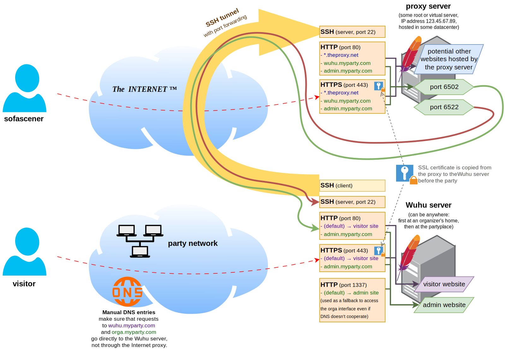

# Wuhu setup scripts

This directory contains two major items:
- `wuhu_setup.sh`: A script that can be used to set up a fully functional Wuhu server on a fresh Debian 12 installation.
- `slideviewer-cables-background-setup.js`: An example on how to integrate a [cables.gl](https://cables.gl) patch as a background for the slide system. _(Requires a feature that it not yet present in upstream Wuhu; use the [CompoKit-specific fork](https://github.com/kajott/wuhu) instead.)_

## The proxy server scheme

The installation is normally meant for an "on-premises" server at the party, not a "cloud-based" system. However, it can be turned into a hybrid solution with the help of a proxy server that sits in some datacenter and is reachable via a static public IP address. The actual Wuhu server can be located anywhere; it connects to the proxy server via SSH to establish a simple VPN-like connection using port forwarding.

In practical terms, this means the following:
- **Before** the party:
  - The Wuhu server is located at some organizer's home or work.
  - The public DNS records of the Wuhu servers point to the proxy server. As a result, when a browser wants to reach the server, it ends up at the web server of the _proxy_.
  - The proxy's web server recognizes accesses to the Wuhu URLs using the standard virtual host mechanism. It strips the SSL and forwards the pure HTTP request to the actual Wuhu server via the SSH tunnel.
  - **Summary:** The Wuhu server is reachable via HTTPS with its usual public domain names, regardless of its physical location.
- During **setup** of the party:
  - The SSL certificates are copied from the proxy server to the Wuhu server, so that the Wuhu server can serve HTTPS itself if it gets a request to the proper virtual hosts.
  - The Wuhu server is physically moved to the party place.
  - The party network's DNS server is configured such that it resolves the domain name(s) of the Wuhu server directly to the IP address of the server that's located in the party network.
- **At** the party:
  - When a browser in the party network wants to reach the Wuhu URLs, it's going straight to the Wuhu server that's located right at the party location.
  - A browser with a non-standard DNS setup (static DNS server like 8.8.8.8, or DNS-over-HTTPS) will still end up at the proxy server. Access to the Wuhu server will continue to work via the proxy mechanism; it's just slower due to the unneccessary round-trip through the Internet (several hundreds of kilometers instead of a few dozen meters).
  - **Summary:** The Wuhu server is still reachable as normal, and an effort is made to have clients connect directly to the on-premises server.
